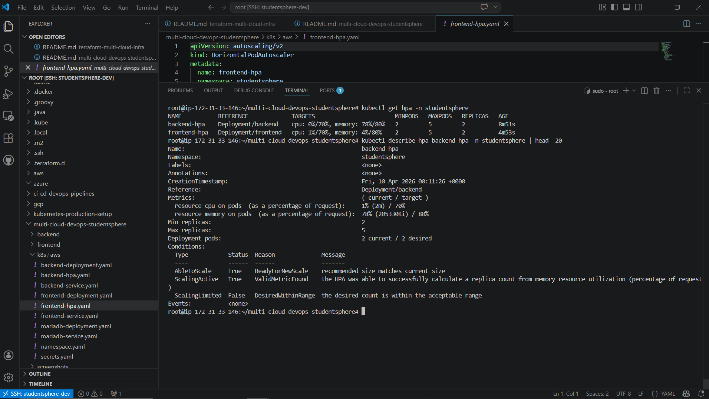
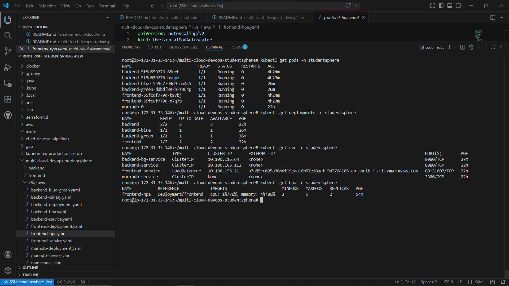

# ☸️ Kubernetes Production Setup

> Production-grade Kubernetes manifests for StudentSphere application.
> Covers AWS EKS deployment, HPA, Canary, Blue-Green, RBAC, and Network Policies.
> Part of the [multi-cloud-devops-studentsphere](https://github.com/manesaurabh1704-devops/multi-cloud-devops-studentsphere) project.

---

## 📁 Repository Structure

```
kubernetes-production-setup/
├── aws/                             # AWS EKS Kubernetes manifests
│   ├── namespace.yaml               # Kubernetes namespace
│   ├── secrets.yaml                 # DB credentials as K8s Secrets
│   ├── mariadb-deployment.yaml      # MariaDB StatefulSet + PVC
│   ├── mariadb-service.yaml         # MariaDB Headless Service
│   ├── backend-deployment.yaml      # Spring Boot Deployment x2
│   ├── backend-service.yaml         # Backend ClusterIP Service
│   ├── frontend-deployment.yaml     # React + Nginx Deployment x2
│   ├── frontend-service.yaml        # Frontend LoadBalancer Service
│   ├── backend-hpa.yaml             # HPA — CPU 70% Memory 95% min2 max5
│   ├── frontend-hpa.yaml            # HPA — CPU 70% Memory 80% min2 max5
│   ├── backend-canary.yaml          # Canary deployment — 33% traffic
│   ├── backend-blue-green.yaml      # Blue-Green — zero downtime switch
│   ├── rbac.yaml                    # ServiceAccounts + Roles + RoleBindings
│   ├── network-policy.yaml          # Default deny + selective allow rules
│   └── argocd-app.yaml              # ArgoCD GitOps application
├── azure/                           # Azure AKS manifests (Phase 9)
├── gcp/                             # GCP GKE manifests (Phase 9)
├── screenshots/                     # Proof of deployment
└── README.md
```

---

## 🏗️ Architecture

```
Internet
    ↓
AWS LoadBalancer
    ↓
Frontend Pods (Nginx x2)
    ↓
Backend Pods (Spring Boot x2)
    ↓
MariaDB StatefulSet (x1)
    ↓
EBS Persistent Volume (5Gi)
```

---

## 📋 Kubernetes Resources

| Resource | Type | Replicas | Description |
|---|---|---|---|
| mariadb | StatefulSet | 1 | Persistent database with EBS volume |
| backend | Deployment | 2 | Spring Boot REST API |
| frontend | Deployment | 2 | React + Nginx |
| frontend-service | LoadBalancer | - | Public internet access |
| backend-service | ClusterIP | - | Internal cluster only |
| mariadb-service | Headless | - | StatefulSet DNS resolution |
| db-secret | Secret | - | Database credentials |
| backend-hpa | HPA | 2-5 | Auto-scale backend on CPU/Memory |
| frontend-hpa | HPA | 2-5 | Auto-scale frontend on CPU/Memory |
| backend-canary | Deployment | 1 | Canary — 33% traffic to new version |
| backend-blue | Deployment | 1 | Blue environment (stable) |
| backend-green | Deployment | 1 | Green environment (new version) |
| backend-sa | ServiceAccount | - | RBAC identity for backend |
| frontend-sa | ServiceAccount | - | RBAC identity for frontend |

---

## ⚡ Phase 2 — Deploy on AWS EKS

### Prerequisites
```bash
aws --version
kubectl version --client
eksctl version
```

### Step 1 — Create EKS Cluster
```bash
eksctl create cluster \
  --name studentsphere-cluster \
  --region ap-south-1 \
  --nodegroup-name studentsphere-nodes \
  --node-type t3.small \
  --nodes 2 \
  --nodes-min 1 \
  --nodes-max 3 \
  --managed
```

Expected output:
```
✔ EKS cluster "studentsphere-cluster" in "ap-south-1" region is ready
```

### Step 2 — Install EBS CSI Driver
```bash
eksctl utils associate-iam-oidc-provider \
  --region ap-south-1 \
  --cluster studentsphere-cluster \
  --approve

eksctl create addon \
  --name aws-ebs-csi-driver \
  --cluster studentsphere-cluster \
  --region ap-south-1 \
  --force
```

### Step 3 — Deploy All Resources
```bash
kubectl apply -f aws/namespace.yaml
kubectl apply -f aws/secrets.yaml
kubectl apply -f aws/mariadb-deployment.yaml
kubectl apply -f aws/mariadb-service.yaml
kubectl apply -f aws/backend-deployment.yaml
kubectl apply -f aws/backend-service.yaml
kubectl apply -f aws/frontend-deployment.yaml
kubectl apply -f aws/frontend-service.yaml
```

### Step 4 — Verify All Pods Running
```bash
kubectl get all -n studentsphere
```

Expected output:
```
NAME                            READY   STATUS    RESTARTS
pod/backend-xxxx                1/1     Running   0
pod/backend-xxxx                1/1     Running   0
pod/frontend-xxxx               1/1     Running   0
pod/frontend-xxxx               1/1     Running   0
pod/mariadb-0                   1/1     Running   0

NAME                       TYPE           EXTERNAL-IP
service/frontend-service   LoadBalancer   xxxx.ap-south-1.elb.amazonaws.com
service/backend-service    ClusterIP      <none>
service/mariadb-service    ClusterIP      None
```

### Step 5 — Get App URL
```bash
kubectl get svc frontend-service -n studentsphere \
  -o jsonpath='{.status.loadBalancer.ingress[0].hostname}'
```

### Output / Proof

#### All Kubernetes Resources Running


#### Nodes Ready


#### App Live on AWS EKS


#### Student Registered on EKS


---

## 🚀 Phase 5 — Advanced Kubernetes Features

### Feature 1 — HPA (Horizontal Pod Autoscaler)

#### What
Automatically scales pods up/down based on CPU and memory usage.

#### Why
```
Without HPA: Fixed 2 pods — cannot handle traffic spikes
With HPA:    Load increases → 2→5 pods auto-scale
             Load decreases → 5→2 pods auto-scale down
```

#### How
```bash
kubectl apply -f aws/backend-hpa.yaml
kubectl apply -f aws/frontend-hpa.yaml
kubectl get hpa -n studentsphere
```

Expected output:
```
NAME           REFERENCE             TARGETS                        MINPODS   MAXPODS   REPLICAS
backend-hpa    Deployment/backend    cpu: 0%/70%, memory: 78%/95%   2         5         2
frontend-hpa   Deployment/frontend   cpu: 1%/70%, memory: 4%/80%    2         5         2
```

---

### Feature 2 — Canary Deployment

#### What
Deploy new version to 33% of traffic — test before full rollout.

#### Why
```
Without Canary: v1 → v2 (100% users affected if bug exists)
With Canary:    v1 (2 pods, 67%) + v2 canary (1 pod, 33%) → test → full rollout
```

#### How
```bash
kubectl apply -f aws/backend-canary.yaml
kubectl get pods -n studentsphere --show-labels | grep canary
```

---

### Feature 3 — Blue-Green Deployment

#### What
Two identical environments — instant traffic switch with zero downtime.

#### Why
```
Blue  = Current stable version (receiving traffic)
Green = New version (tested in parallel)
Switch = kubectl patch → zero downtime!
Rollback = kubectl patch back → instant!
```

#### How
```bash
# Apply blue-green
kubectl apply -f aws/backend-blue-green.yaml

# Switch Blue → Green
kubectl patch svc backend-bg-service -n studentsphere \
  -p '{"spec":{"selector":{"app":"backend","version":"green"}}}'

# Rollback Green → Blue
kubectl patch svc backend-bg-service -n studentsphere \
  -p '{"spec":{"selector":{"app":"backend","version":"blue"}}}'
```

### Output / Proof

#### HPA Working


#### Canary Deployment


#### Blue-Green Switch


#### All Deployments Running


---

## 🆚 Deployment Strategy Comparison

| Strategy | Downtime | Risk | Use Case |
|---|---|---|---|
| Rolling Update | Zero | Medium | Normal updates |
| Canary | Zero | Low | Test new version on 33% traffic |
| Blue-Green | Zero | Very Low | Instant switch with rollback |
| Recreate | Yes | High | Dev/test environments only |

---

## 🐛 Troubleshooting

### Problem 1 — t3.medium Launch Failed
```
Error: InvalidParameterCombination - instance type not eligible
Fix:   --node-type t3.small
```

### Problem 2 — MariaDB Pod Pending
```bash
# Error
0/2 nodes available: pod has unbound PersistentVolumeClaims

# Fix 1 — Install EBS CSI Driver
eksctl create addon --name aws-ebs-csi-driver \
  --cluster studentsphere-cluster --region ap-south-1 --force

# Fix 2 — Add storageClassName in mariadb yaml
storageClassName: gp2
```

### Problem 3 — Frontend CrashLoopBackOff
```bash
# Error
host not found in upstream "backend"

# Fix in nginx.conf
proxy_pass http://backend-service:8080/api/;
# Use K8s service name not Docker Compose name
```

### Problem 4 — HPA Shows unknown Metrics
```
Error: cpu: <unknown>/70%
Fix:   Wait 2-3 minutes for metrics server to populate
       kubectl get pods -n kube-system | grep metrics
```

### Problem 5 — Blue-Green Pods Pending
```
Error: 0/2 nodes available
Fix:   Scale down other deployments first
       kubectl scale deployment backend --replicas=2 -n studentsphere
```

### Problem 6 — HPA Keeps Scaling Up
```
Error: Too many pods on t3.small nodes
Fix:   Increase memory threshold in backend-hpa.yaml
       averageUtilization: 95
```

---

## 🔗 Related Repositories

| Repository | Purpose |
|---|---|
| [multi-cloud-devops-studentsphere](https://github.com/manesaurabh1704-devops/multi-cloud-devops-studentsphere) | Main project — Full DevOps system |
| [terraform-multi-cloud-infra](https://github.com/manesaurabh1704-devops/terraform-multi-cloud-infra) | Infrastructure as Code |
| [ci-cd-devops-pipelines](https://github.com/manesaurabh1704-devops/ci-cd-devops-pipelines) | Jenkins CI/CD pipelines |
| [monitoring-observability-stack](https://github.com/manesaurabh1704-devops/monitoring-observability-stack) | Prometheus + Grafana |
| [devops-security-secrets](https://github.com/manesaurabh1704-devops/devops-security-secrets) | RBAC + Security |

---

## 👨‍💻 Author
**Saurabh Mane** — DevOps Engineer
- GitHub: [@manesaurabh1704-devops](https://github.com/manesaurabh1704-devops)

---

> ⭐ Star this repo if you find it helpful!
