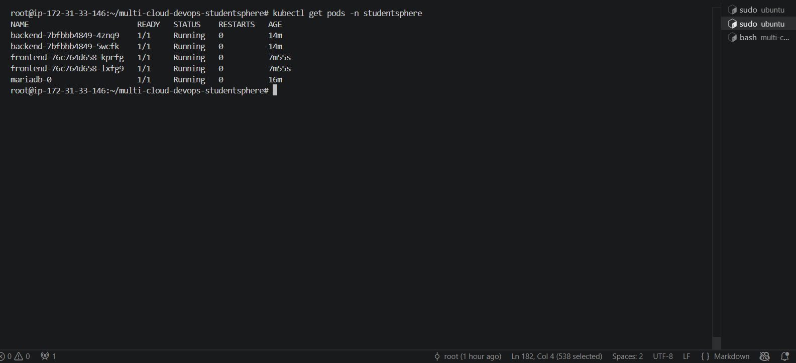
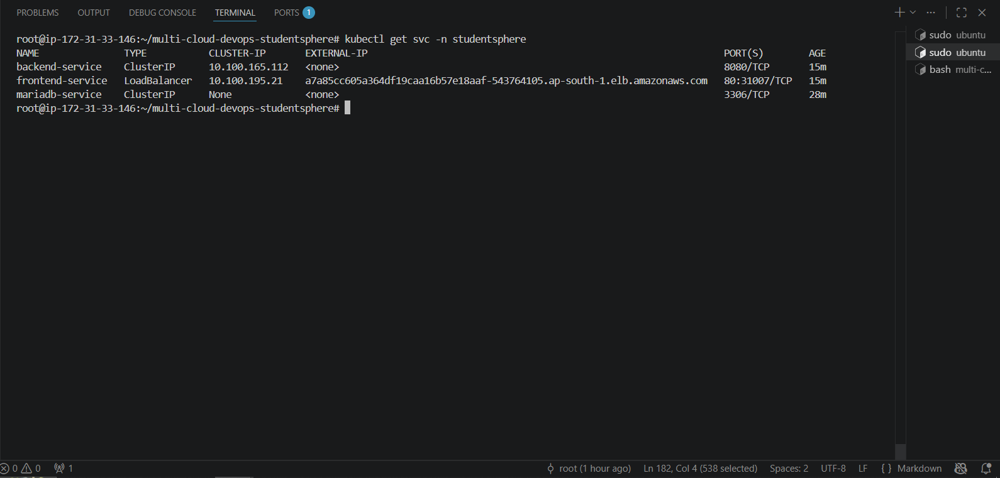
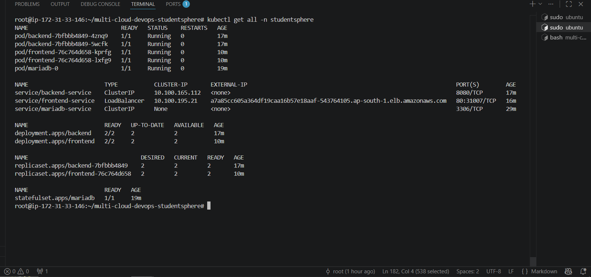
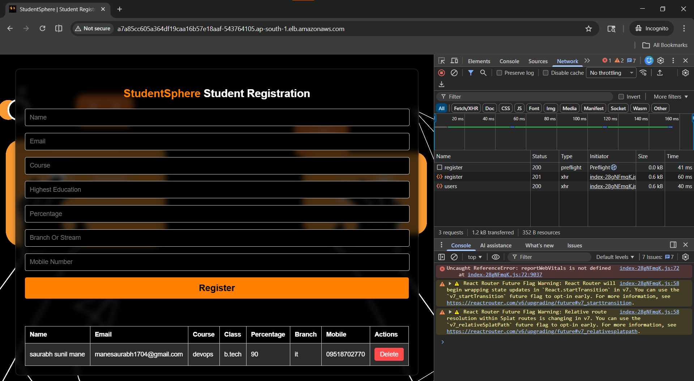

# ☸️ Kubernetes Production Setup

> Production-grade Kubernetes manifests for StudentSphere application.
> Part of the [multi-cloud-devops-studentsphere](https://github.com/manesaurabh1704-devops/multi-cloud-devops-studentsphere) project.

---

📁 **Repository Structure**

```bash
kubernetes-production-setup/

├── common/                         # Shared Kubernetes resources
│   ├── namespace.yaml              # Application namespace
│   └── secrets.yaml                # Database credentials (K8s Secrets)
│
├── aws/                            # AWS EKS Kubernetes manifests
│   ├── database/
│   │   ├── mariadb-statefulset.yaml   # MariaDB StatefulSet + PVC
│   │   └── mariadb-service.yaml       # MariaDB ClusterIP Service
│   │
│   ├── backend/
│   │   ├── backend-deployment.yaml    # Spring Boot (replicas: 2)
│   │   └── backend-service.yaml       # Backend ClusterIP Service
│   │
│   ├── frontend/
│   │   ├── frontend-deployment.yaml   # React + Nginx (replicas: 2)
│   │   └── frontend-service.yaml      # Frontend LoadBalancer Service
│
├── azure/                          # Azure AKS manifests (Phase 2)
│   └── [To be implemented]
│
├── gcp/                            # Google GKE manifests (Phase 3)
│   └── [To be implemented]
│
└── README.md                       # Project documentation
```


---

## 🏗️ Architecture
Internet
↓
AWS LoadBalancer
↓
Frontend Pods (Nginx x2)
↓
Backend Pods (Spring Boot x2)
↓
MariaDB StatefulSet (x1)
↓
EBS Persistent Volume (5Gi)

---

## 📋 Kubernetes Resources

| Resource | Type | Replicas | Description |
|---|---|---|---|
| mariadb | StatefulSet | 1 | Persistent database with EBS volume |
| backend | Deployment | 2 | Spring Boot REST API |
| frontend | Deployment | 2 | React + Nginx |
| frontend-service | LoadBalancer | - | Public internet access |
| backend-service | ClusterIP | - | Internal cluster only |
| mariadb-service | Headless | - | StatefulSet DNS resolution |
| db-secret | Secret | - | Database credentials |

---

## ⚡ How to Deploy on AWS EKS

### Prerequisites
```bash
aws --version
kubectl version --client
eksctl version
```

### Step 1 — Create EKS Cluster
```bash
eksctl create cluster \
  --name studentsphere-cluster \
  --region ap-south-1 \
  --nodegroup-name studentsphere-nodes \
  --node-type t3.small \
  --nodes 2 \
  --nodes-min 1 \
  --nodes-max 3 \
  --managed
```

Expected output:
✔ EKS cluster "studentsphere-cluster" in "ap-south-1" region is ready

### Step 2 — Install EBS CSI Driver
```bash
eksctl utils associate-iam-oidc-provider \
  --region ap-south-1 \
  --cluster studentsphere-cluster \
  --approve

eksctl create addon \
  --name aws-ebs-csi-driver \
  --cluster studentsphere-cluster \
  --region ap-south-1 \
  --force
```

### Step 3 — Deploy All Resources
```bash
kubectl apply -f aws/namespace.yaml
kubectl apply -f aws/secrets.yaml
kubectl apply -f aws/mariadb-deployment.yaml
kubectl apply -f aws/mariadb-service.yaml
kubectl apply -f aws/backend-deployment.yaml
kubectl apply -f aws/backend-service.yaml
kubectl apply -f aws/frontend-deployment.yaml
kubectl apply -f aws/frontend-service.yaml
```

### Step 4 — Verify All Pods Running
```bash
kubectl get all -n studentsphere
```

### Step 5 — Get App URL
```bash
kubectl get svc frontend-service -n studentsphere \
  -o jsonpath='{.status.loadBalancer.ingress[0].hostname}'
```

---

## 📸 Output / Proof

### All Kubernetes Resources Running


### Nodes Ready


### App Live on AWS EKS


### Student Registered on EKS



---

## 🐛 Troubleshooting

### Problem 1 — t3.medium Launch Failed
Error: InvalidParameterCombination - instance type not eligible
Fix:   Use t3.small instead of t3.medium

### Problem 2 — MariaDB Pod Pending
```bash
# Error
0/2 nodes available: pod has unbound PersistentVolumeClaims

# Fix — Install EBS CSI Driver + add storageClassName
storageClassName: gp2
```

### Problem 3 — Frontend CrashLoopBackOff
```bash
# Error
host not found in upstream "backend"

# Fix — nginx.conf
proxy_pass http://backend-service:8080/api/;
# Use backend-service (K8s service name) not backend (Docker Compose name)
```

---

## 🔗 Related Repositories

| Repository | Purpose |
|---|---|
| [multi-cloud-devops-studentsphere](https://github.com/manesaurabh1704-devops/multi-cloud-devops-studentsphere) | Main project — Full DevOps system |
| [terraform-multi-cloud-infra](https://github.com/manesaurabh1704-devops/terraform-multi-cloud-infra) | Infrastructure as Code |
| [ci-cd-devops-pipelines](https://github.com/manesaurabh1704-devops/ci-cd-devops-pipelines) | Jenkins CI/CD pipelines |
| [monitoring-observability-stack](https://github.com/manesaurabh1704-devops/monitoring-observability-stack) | Prometheus + Grafana |
| [devops-security-secrets](https://github.com/manesaurabh1704-devops/devops-security-secrets) | RBAC + Security |

---

## 👨‍💻 Author
**Saurabh Mane** — DevOps Engineer
- GitHub: [@manesaurabh1704-devops](https://github.com/manesaurabh1704-devops)

---

> ⭐ Star this repo if you find it helpful!
